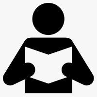
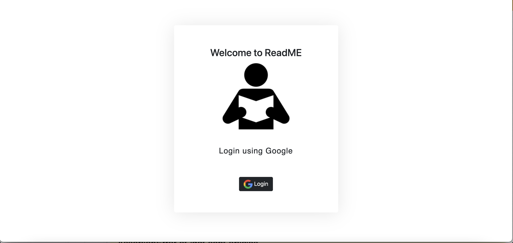
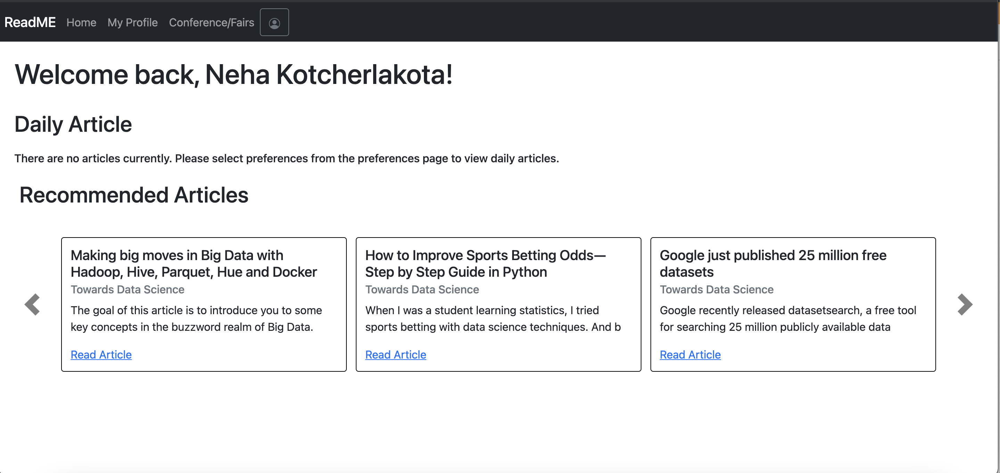
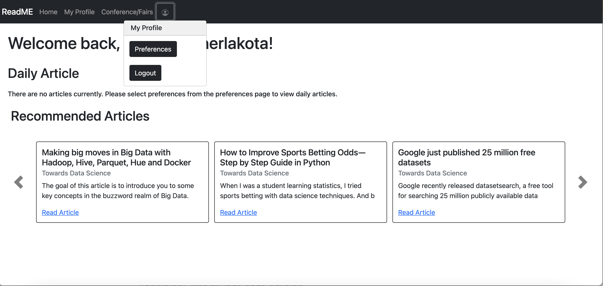
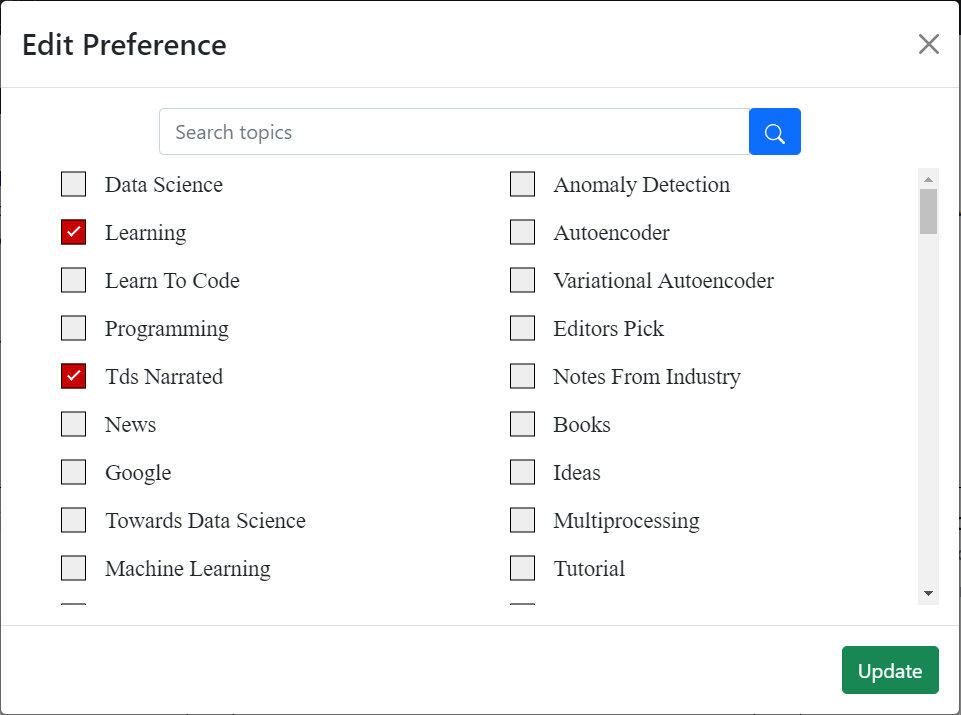
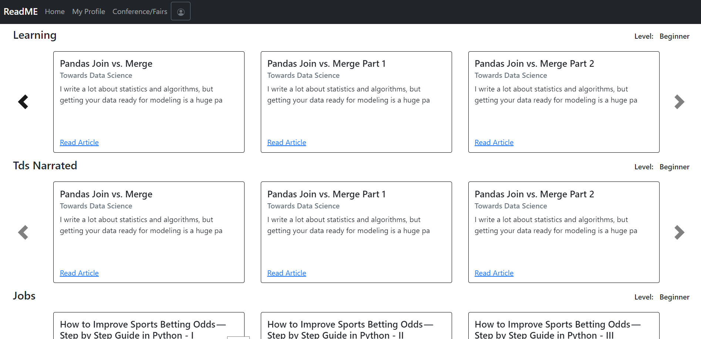
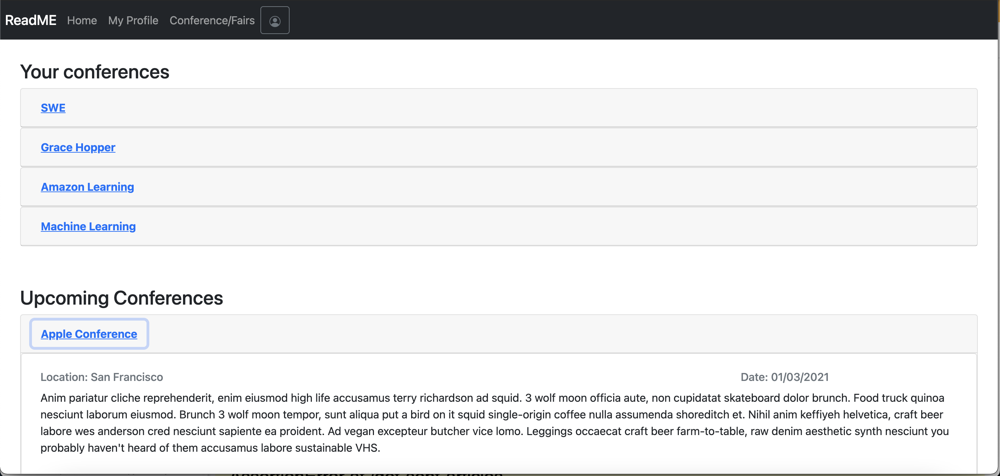
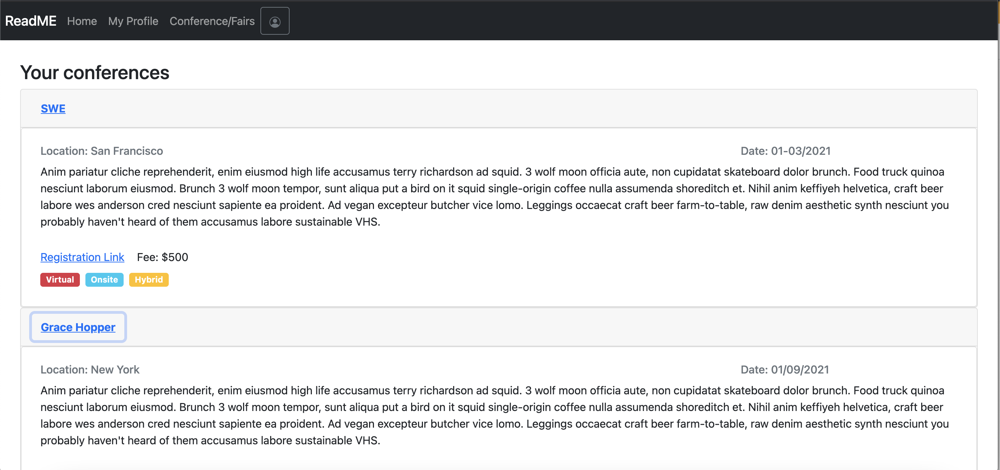

[](https://zenodo.org/record/5539790#.YVZISy1h1QJ) [](https://app.travis-ci.com/github/niveditalodha/ReadME) [](https://codecov.io/gh/niveditalodha/ReadME)     


---

# ReadME

 

ReadMe is a web application that gathers articles from the internet and recommends them to users depending on their likes.
- User can connect to the applications and select choices such as Machine Learning, Programming, Data Science, and Dev Ops etc. So that only the articles from those areas are shown to the user.
- Every day, an article is sent to the user's email address based on their choices.
- The user can search for an article from a pool of articles or use filters to find articles from a specific domain.
- As a mark of thanks, enthusiastic readers are granted a User Badge.

---
## App Link

https://readme-app.herokuapp.com/login

---
## Techonologies Used

Below are the techonologies that we have used to build the application.
- Python3
- Django
- Angular
- HTML
- CSS
- JavaScript
- TypeScript

---

## Installation Steps 
1. Install the packages needed for the project
	```
	pip install -r requirements.txt
	```
2. Create a virtual Enviornment
	```
	virtualenv venv 
	```
3. Activate the Environment
	```
	source venv/scripts/activate 
	```
3. Run the migration commands to create tables in the database
	
	```
	python manage.py makemigrations
	```
	```
	python manage.py migrate
	```
4. Create the login credentials when prompted and don't forget to save this, because the same credentials are used to login to the admin console
	```
	python manage.py createsuperuser
	```

---

## Back-End Execution Steps 

1. Run `python3 manage.py runserver` from the folder `/codeletter`. 
2. Next, open the browser and enter, https://localhost:{port_number}}/ to make post requests to APIs.
3. At the admin/ page, you can add dummy data in the models and make POST requests to test the APIs. 
4. The API url is https://readme17se.pythonanywhere.com/ and their endpoints and respective documentation is available at [here](https://docs.google.com/spreadsheets/d/1H-hvEmOf9RNG6zr111A7DrE30HSd6UZr67vFTpskBXE/edit?usp=sharing).
5. The concepts and articles are scraped from towardsdatascience.com and the scraper function get_scraped_content(year) is available in the file codeletter/utils.py.
6. The file codeletter/send_articles_daily.py contains a function cronjob() which takes all users from the database and sends them a new article everyday based on their preference. 

---

## Web UI

1. Login - The User can login using google account.

 

2. Home - The article of the day and list of recommended articles will be available in this page.

 

3. On click of user icon, the options to update article subject preference and log out will be displayed.



4. On click of preference, update preference pop-up will be displayed.



5. My Profile - The articles sent to the user till date will be categorized under the selected preferences.



6. Conference Page - Upcoming Conference with the link to registeration will be available.



7. Conference Page - Your Conferences - The registered conferences are listed under your conferences with add to calendar option.



---

## Front-End Execution Steps

1. Clone the project. Code for the front-end is available in ReadME/UI.
2. Setup [Node](https://nodejs.org/en/download/) and [Angular CLI](https://angular.io/cli) in your desktop. 
3. Open the command prompt and navigate to the UI Directory.
4. Install the node packages using the command
	```
	npm install
	```
5. Serve the angular application in your local environment using the command 
	```
	ng serve --o
	```
6. The application will be served in the url http://localhost:4200 of your default browser.
---

## FUTURE SCOPE

- Allows users to choose a topic, and articles from that topic are sent to them every day in such a way that each article is related to the one before it. This allows the individual to master that particular area.
- List of research conferences happening.
- Expand the number of domains/areas; right now, we're just showing articles from a few, but there's obviously room for more.

---

## Contact Us

Email : [csc510project21@gmail.com](csc510project21@gmail.com)

---


## Team Members

- Nivedita Lodha
- Uma Gnanasundaram
- Sai Naga Vamshi Chidara
- Neha Kotcherlakota
- Akhil Kumar Mengani
				

